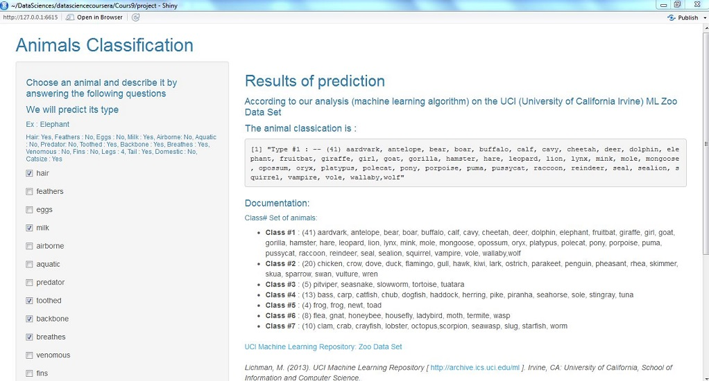

```{r setup, include=FALSE}
knitr::opts_chunk$set(echo = FALSE)
```

## UCI Machine Learning Repository: Zoo Data Set

Data Set Information: http://archive.ics.uci.edu/ml/datasets/zoo

It's a simple database of 101 rows containing 17 Boolean-valued attributes and classified in 7 classes.

```{r, echo=TRUE}
#Load dataset
zoo_df <- read.csv("../data/zoo.data")
names(zoo_df) <- c("animal_name", "hair", "feathers","eggs", "milk", "airborne", "aquatic",
                  "predator", "toothed", "backbone", "breathes", "venomous", "fins", "legs",
                  "tail","domestic", "catsize", "type")
head(zoo_df,3)
```

## Aim of the shiny App

* Perform a classification algorithm (_random forest_) on the data set in order to build a prediction function
* Build an interface to be able to describe an animal with an integer valued atribute (_number of legs_) and 15 boolean-valued attributes : _hair, feathers, eggs, milk, airborne, aquatic, predator, toothed, backbone, breathes, venomous, fins, legs, tail, domestic, catsize_.
* Perform a prediction with these attributes to dynamically classify the animal in one of the 7 available classes.


## Machine Learning classification (server side of the shiny app)

```{r, message=FALSE, warning=FALSE}
zoo_df$type <- as.factor(zoo_df$type)
```

```{r, echo=TRUE, message=FALSE, warning=FALSE,cache=TRUE}
library(caret)
set.seed(2605)
zoo_df <- zoo_df[,-c(1)] #delete the first column : Animal name

#Split the dataset in two subsets: training and testing
inTrain <- createDataPartition(y = zoo_df$type, p=0.7, list=FALSE)
train <- zoo_df[inTrain,]
test <- zoo_df[-inTrain,]

#Random Forest Training
modFit_rf <- train(type ~ ., method="rf", data =train, verbose = F)
confusionMatrix(test$type,predict(modFit_rf, newdata=test))$overall #Show the confusion matrix
```

It is a smal dataset : the training is quickly performed. The accuracy is excellent.

## The shiny App

https://jetzgetzlos.shinyapps.io/DDPProject_Animals_Classification/



